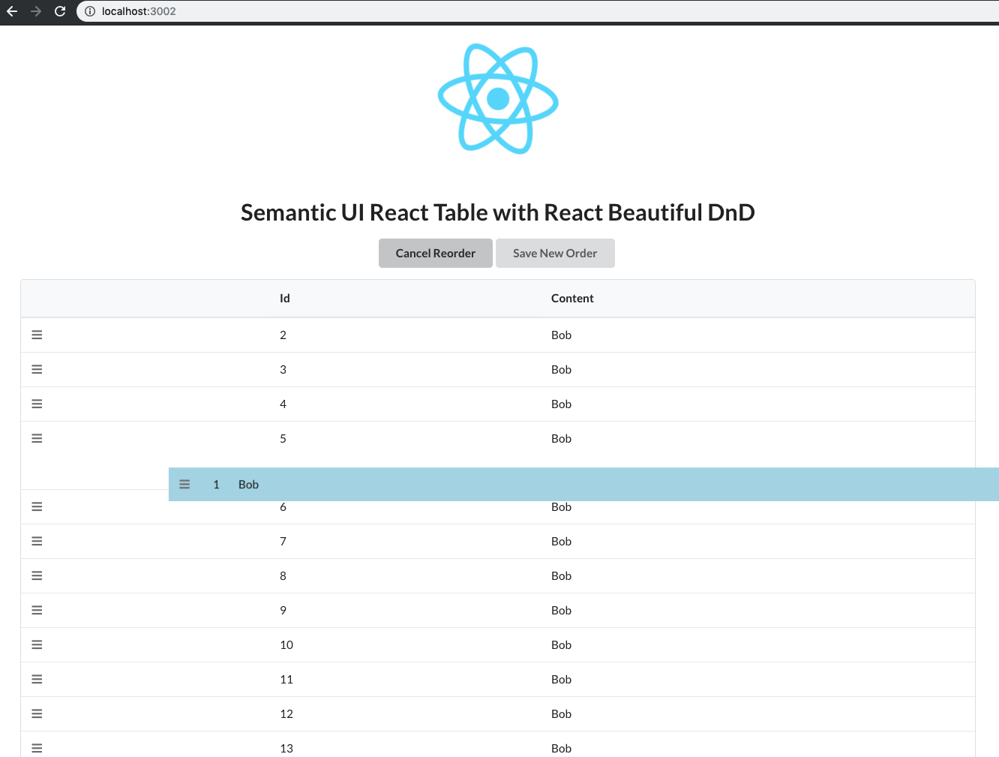
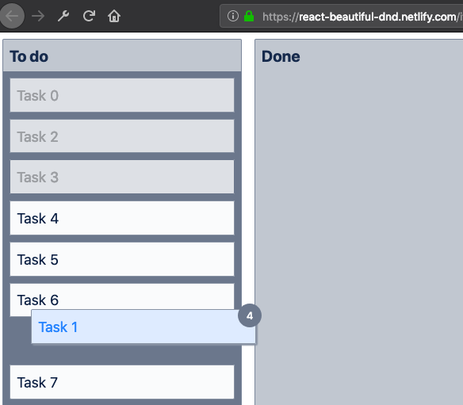

# React Beautiful Drag & Drop Semantic UI Table 🎩

### Includes Multi-Drag feature utilization ✅

## Utilized Tools 🔧
Project bootstrapped with [Create React App](https://github.com/facebook/create-react-app).

DnD capability from [React Beautiful DnD](https://github.com/atlassian/react-beautiful-dnd).

Table & Components from [Semantic UI React](https://github.com/Semantic-Org/Semantic-UI-React)

## Try Out 🚀

Open terminal, and cd into location for project to be downloaded.
### `cd Desktop/`

clone down to local machine.

### `git clone https://github.com/Frankcarvajal/rdnd-rsui-table.git`

Use yarn or npm to install dependencies.

### `yarn`

Run the app in development mode.

### `yarn start`

Open [http://localhost:3000](http://localhost:3000) to view it in the browser.

The page will reload if you make edits via hot reloading.  

## Current Example (missing multi-drag) 🔥

## RB-DnD Storbook Multi-Drag Example shot
### This is what I want to add to the table. 🙏🏽

